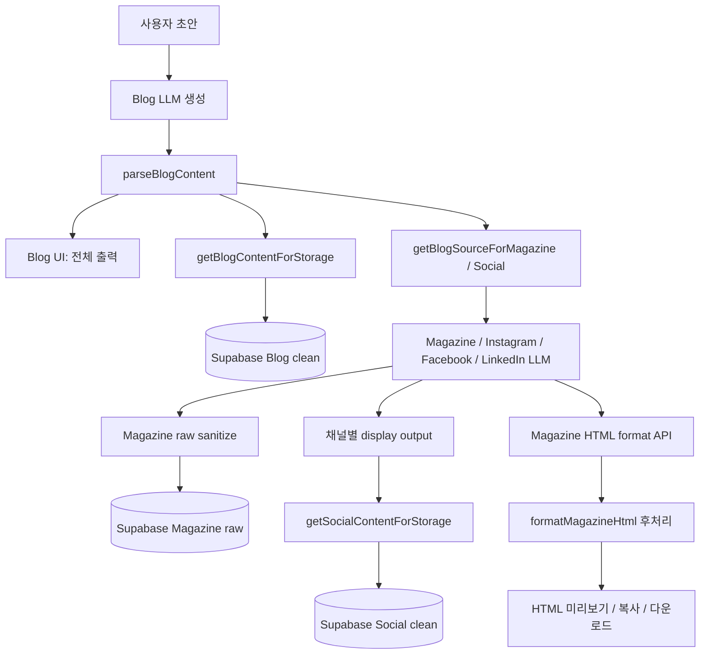
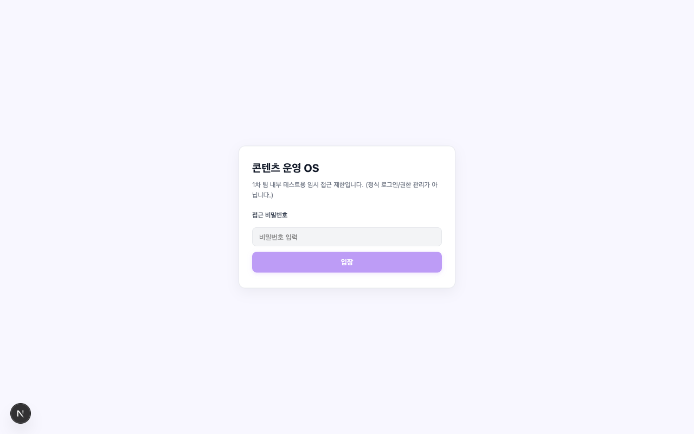
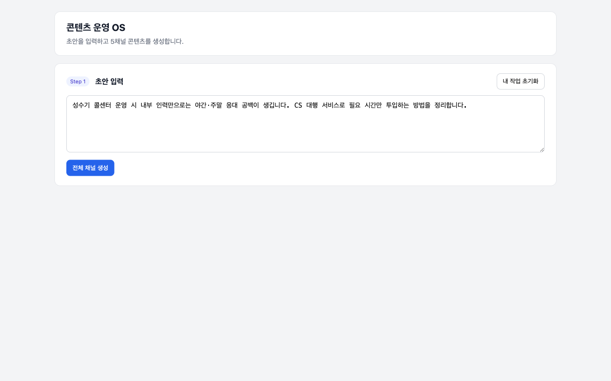
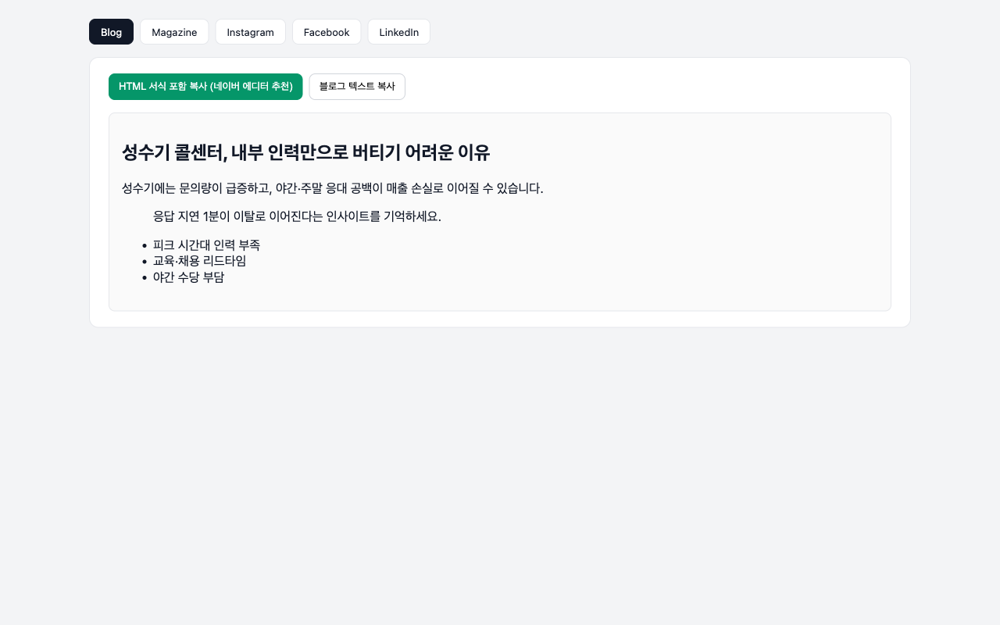
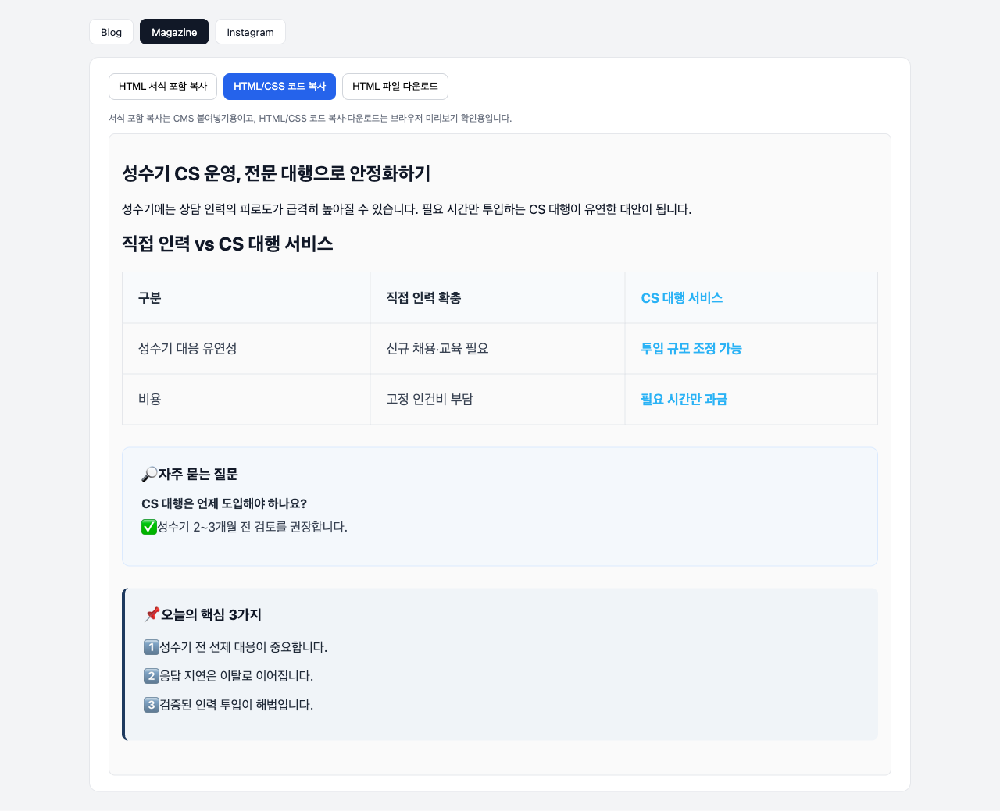
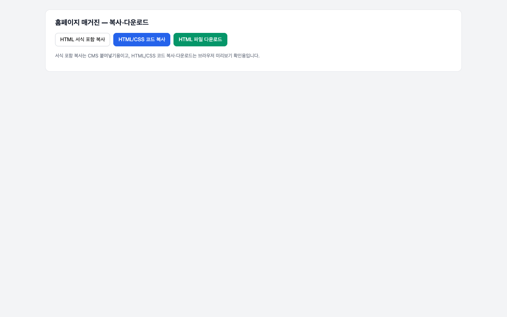
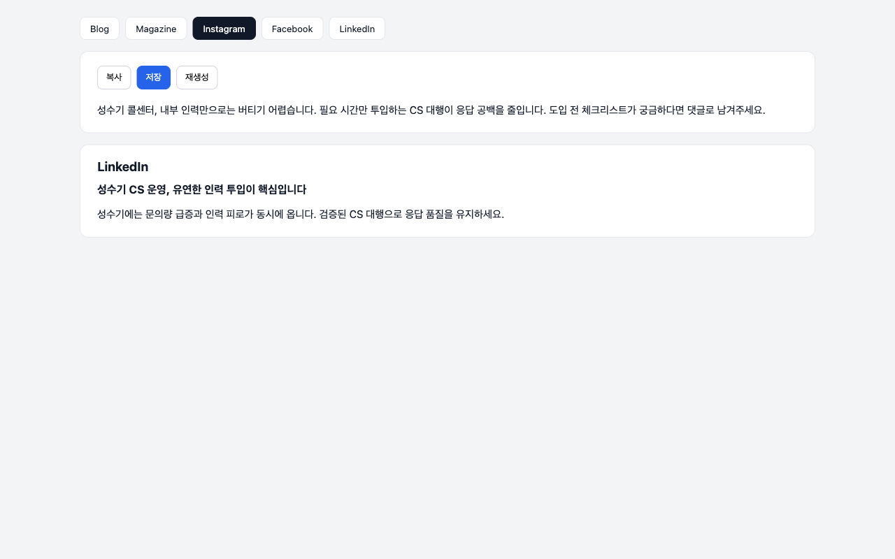
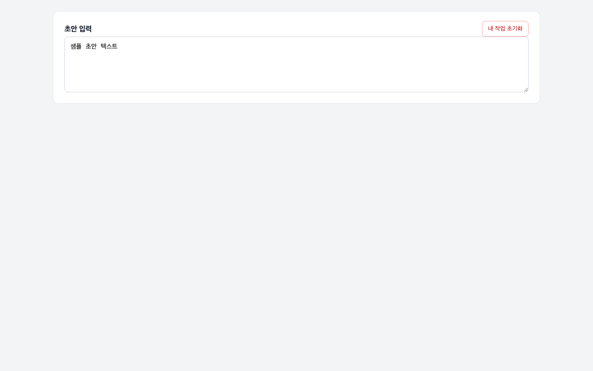
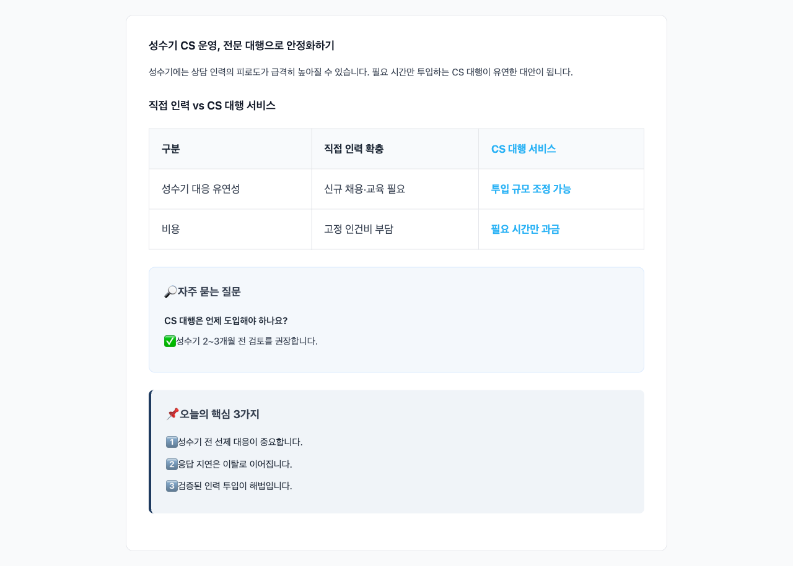

# CS쉐어링 콘텐츠 운영 OS — MVP

Next.js 기반 **B2B 콘텐츠 생성 자동화** 웹앱입니다. 사용자 초안을 입력하면 **5개 채널**(네이버 블로그, 홈페이지 매거진, Instagram, Facebook, LinkedIn) 원고를 생성하고, HTML 미리보기·복사·Supabase 저장까지 한 화면에서 처리합니다.

**Blog가 master source**입니다. Magazine과 소셜 채널은 Blog clean content(제목+본문)를 기반으로 파생 생성됩니다.

---

## 주요 기능

| 기능 | 설명 |
|------|------|
| 네이버 블로그 생성 | 상세 지침 + HTML 미리보기 + 복사 |
| Blog clean 저장 | Supabase에 제목+본문만 저장 (태그·자기점검 제외) |
| 홈페이지 매거진 | raw(저장) / HTML(미리보기) 분리 |
| Magazine HTML 미리보기 | FAQ·핵심·표·placeholder 후처리 |
| Magazine 복사·다운로드 | HTML 서식 포함 복사 / HTML·CSS 코드 복사 / `.html` 다운로드 |
| Instagram / Facebook / LinkedIn | Blog 기반 재작성, UI 단순 표시 |
| 소셜 clean 저장 | emoji·해시태그·Markdown·채널 라벨 제거 후 저장 |
| Supabase 저장 | 채널별 clean text + ⭐ 고성과 저장 |
| 참고자료 재활용 | 고성과 글 RAG 참조 |
| 내 작업 초기화 | localStorage 초기화 (Supabase 데이터는 유지) |
| 접근 비밀번호 | 1차 팀 내부 테스트용 임시 게이트 |

---

## MVP 범위 (현재)

**포함**

- 5채널 원고 생성 + HTML 미리보기/복사/저장
- Blog → Magazine → 소셜 파생 생성 파이프라인
- Magazine table/FAQ/핵심/placeholder 후처리

**후속 단계 (이번 MVP 제외)**

- 카드뉴스 / Canva 연동
- 이미지 AI / PDF·PPTX export
- 자동 발행, 정식 로그인, 성과 대시보드

실험 코드(블로그 시각화 자동 생성, 인스타 카드뉴스)는 feature flag로 숨겨져 있으며 기본 배포에 포함하지 않습니다.

---

## 콘텐츠 생성 파이프라인



---

## 저장 정책

| 채널 | Supabase `content` | 저장하지 않는 것 |
|------|-------------------|------------------|
| **Blog** | 채택 제목 + 본문 clean text | 추천 태그, 대체 제목, 시각화 제안, 자기점검, HTML |
| **Magazine** | `magazineContentRaw` (순수 텍스트) | HTML, CSS, `[시각화 자료…]`, table 태그, Markdown 표 |
| **Instagram / Facebook / LinkedIn** | social clean text | emoji, `#` 해시태그, Markdown heading/separator, 채널 라벨 |

HTML/CSS 코드 복사·`.html` 다운로드는 **UI 편의 기능**이며 Supabase에는 저장되지 않습니다.

---

## 로컬 실행

```bash
cd mvp_5w
npm install
cp .env.example .env.local   # 값 채우기
npm run dev
```

브라우저: [http://localhost:3000](http://localhost:3000)

```bash
npm run lint
npm run build
```

### 단위·E2E 테스트 스크립트

```bash
npx tsx scripts/test-magazine-html-format.ts
npx tsx scripts/test-content-storage.ts

# dev server 실행 후 (ANTHROPIC_API_KEY 필요)
node --env-file=.env.local $(which npx) tsx scripts/test-e2e-llm-pipeline.ts
```

---

## 환경변수

### Vercel 필수 (MVP)

```env
LLM_PROVIDER=anthropic
ANTHROPIC_API_KEY=
ANTHROPIC_DRAFT_MODEL=claude-sonnet-4-6
ANTHROPIC_BLOG_HTML_MODEL=claude-sonnet-4-6

APP_ACCESS_PASSWORD=

SUPABASE_URL=
SUPABASE_SECRET_KEY=
```

### 선택 (없어도 MVP 기본 흐름 동작)

```env
ANTHROPIC_OUTLINE_MODEL=
ANTHROPIC_REVIEW_MODEL=
NEXT_PUBLIC_SUPABASE_URL=
NEXT_PUBLIC_BRAND_ASSET_BUCKET=
```

### 실험 기능 전용 (기본 배포에 넣지 않음)

```env
ANTHROPIC_BLOG_VISUAL_MODEL=
ANTHROPIC_CARDNEWS_MODEL=
ANTHROPIC_CARDNEWS_THINKING=
ANTHROPIC_CARDNEWS_EFFORT=
NEXT_PUBLIC_ENABLE_BLOG_VISUAL_GENERATOR=
NEXT_PUBLIC_ENABLE_INSTAGRAM_CARDNEWS=
```

**주의:** `.env.local`은 Git에 올리지 마세요. API 키·Supabase Secret은 서버 API Route에서만 사용합니다.

---

## Vercel 배포

1. 저장소 연결
2. **Root Directory:** `mvp_5w`
3. `.env.local` 업로드 금지 → Project Settings → Environment Variables에 필수 env 입력
4. `main` push 시 자동 배포
5. env 변경 후 **Redeploy** 필요

---

## 프롬프트·source·저장 위치

상세 파일 맵: [`docs/PROMPTS.md`](docs/PROMPTS.md)

| 항목 | 파일 |
|------|------|
| 채널별 기본 프롬프트 | `src/lib/prompts/base-prompts.ts` |
| Blog 상세 지침 | `src/lib/prompts/channel-guides/naver-blog-guide.ts` |
| 프롬프트 조립 (`buildPrompt`) | `src/lib/prompts/build-prompt.ts` |
| Magazine HTML LLM 프롬프트 | `src/lib/prompts/magazine-html-format-prompt.ts` |
| Magazine HTML 후처리 (table/FAQ/placeholder) | `src/lib/magazine/formatMagazineHtml.ts` |
| Magazine standalone HTML | `src/lib/magazine/buildMagazineStandaloneHtml.ts` |
| Blog source / 저장 | `src/lib/blog/getBlogContentForStorage.ts` |
| Magazine 저장 sanitize | `src/lib/magazine/sanitizeMagazineRaw.ts` |
| 소셜 UI·저장 sanitize | `src/lib/social/sanitizeSocialContent.ts` |
| 저장 분기 | `src/app/page.tsx` → `resolveContentForSave()` |
| 생성 트리거 | `src/hooks/useGeneration.ts` |

---

## 테스트 방법

1. **Blog 생성** → HTML 미리보기·복사 확인
2. **Magazine 생성** → table/FAQ/핵심/placeholder 위치 확인
3. **Magazine HTML/CSS 코드 복사** → `.html` 저장 후 브라우저에서 table 스타일 확인
4. **Instagram / Facebook / LinkedIn** → Blog 기반 생성, UI 라벨·Markdown 없음 확인
5. **저장** → Supabase `content`가 채널별 clean text인지 확인
6. **내 작업 초기화** → localStorage 비움 확인

---

## UI 스크린샷

샘플 데이터 기준 UI입니다. API 키·민감 정보는 포함하지 않았습니다.

| 화면 | 스크린샷 |
|------|----------|
| 접근 비밀번호 게이트 |  |
| 메인 입력 |  |
| 네이버 블로그 HTML 미리보기 |  |
| 홈페이지 매거진 HTML 미리보기 |  |
| Magazine 복사·다운로드 버튼 |  |
| 소셜 채널 출력 |  |
| 내 작업 초기화 |  |
| Magazine standalone HTML (table) |  |

스크린샷 재생성:

```bash
npx tsx scripts/capture-readme-screenshots.ts
```

---

## 프로젝트 구조

```
src/
├── app/
│   ├── page.tsx
│   └── api/
│       ├── generate/              # 5채널 LLM 생성
│       ├── blog-html-format/      # 블로그 HTML 미리보기
│       ├── magazine-html-format/  # 매거진 HTML + 후처리
│       ├── content/               # Supabase 저장
│       ├── references/            # 고성과 참고자료
│       └── access/                # 임시 접근 게이트
├── components/
│   ├── blog/BlogOutputPanel.tsx
│   ├── magazine/MagazineOutputPanel.tsx
│   ├── social/SocialOutputPanel.tsx
│   └── instagram/InstagramOutputPanel.tsx
├── hooks/
│   ├── useGeneration.ts
│   ├── useBlogEnhancement.ts
│   └── useMagazineEnhancement.ts
└── lib/
    ├── blog/
    ├── magazine/
    ├── social/
    ├── prompts/
    └── storage/
```

---

## Supabase 스키마

`docs/supabase-schema.sql` 참고. 최소 테이블:

```sql
create table if not exists contents (
  id uuid primary key default gen_random_uuid(),
  channel text not null,
  content_type text,
  goal text,
  tone text,
  draft text,
  content text not null,
  is_high_performance boolean not null default false,
  created_at timestamptz not null default now(),
  updated_at timestamptz not null default now()
);
```

---

## 내 작업 초기화

초안 입력 영역 옆 **「내 작업 초기화」** 버튼:

- 초안, 5채널 결과, enhancement 상태, `cssharing-` prefix localStorage 삭제
- Supabase에 저장된 데이터는 **삭제하지 않음**

---

## 임시 접근 비밀번호

- 환경변수: `APP_ACCESS_PASSWORD`
- 로컬에서 비어 있으면 게이트 비활성화
- 정식 로그인/권한 관리가 아닌 1차 팀 내부 테스트용
